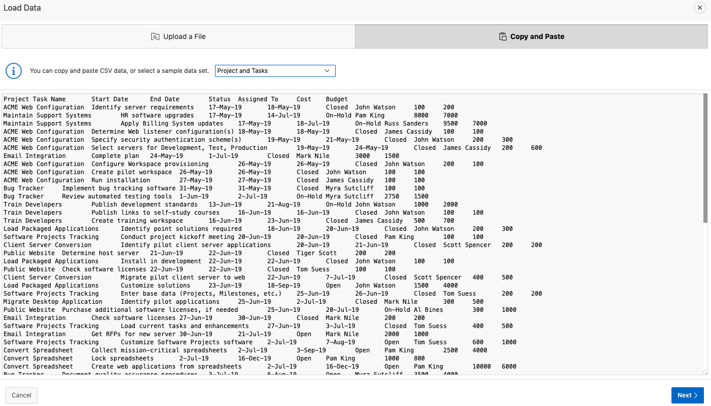

# Lab 2: Create an App From a Spreadsheet

## Introduction

Now that you are logged into your workspace, you can now start creating Oracle APEX applications. The application you will build is a simple application based on a spreadsheet, however, you can also build large complex apps based on local database objects, REST enabled SQL objects, or REST APIs.

Within the Oracle APEX development environment (IDE) you will spend the majority of your time in the App Builder. In your own time you should also investigate SQL Workshop where you can create, review, and maintain database objects, Team Development where you can track large APEX development projects, and the App Gallery which contains numerous productivity and sample apps which can be installed within a few minutes. The productivity apps are self-contained, fully functional apps that you can use to meet common business requirements.

***To log issues***, click here to go to the [github oracle](https://github.com/oracle/learning-library/issues/new) repository issue submission form.

## Lab 2 Objectives

- Load Project and Tasks Data 
- Create and Run Application

## Steps

### **STEP 1:** Load Project and Tasks Data

-  Click **App Builder**, then click **Create a New App**
{Note: You can also click Create if you already have an app defined}

  

- Click **From a File**.

  

When creating an application from a file, Oracle APEX allows you to drag and drop or upload CSV, XLSX, XML, or JSON files and then build apps based on that data. Alternatively, you can also copy and paste CSV data or load sample data. 

- Within the wizard, click **Copy and Paste**.
From the sample data set list select **Project and Tasks** and click **Next**.

  

- Review the pasted data, and for Table Name enter **SPREADSHEET** and click **Load Data**.
{Note: The Error Table Name is automatically populated based on the Table Name with a postfix of _ERR$ }

  

### **STEP 2:** Create and Run Application

The wizard has created a new table and populated that table with the records from the sample data. Now you can create an app based on this new table.

- Click **Continue to Create Application Wizard**.

  

- Within the Create Application Wizard, for Name enter **App from a Spreadsheet**, 
for Features click **Check All** and click **Create Application**.

  
  
  

Now that the wizard has created the app, you should run the app to review what has been created.

- Click **Run Application**.

  

- On the Sign In page, enter your database username and password as entered in step 1. D. above. Click **Sign In**. 

- Click on the navigation menu options to review the report and click the edit icon on a record to display the form page. Review the charts displayed on the dashboard page, and review the options available under Administration.

  

**This completes the Lab!**

**You are ready to proceed to [Lab 3](?page=Lab3.md)**
